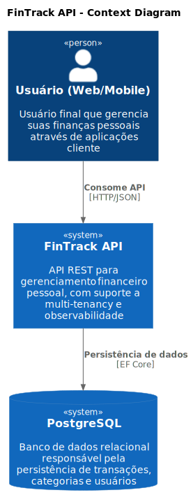
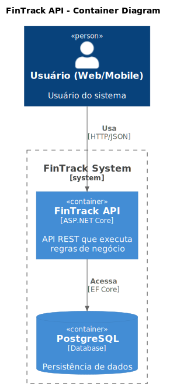
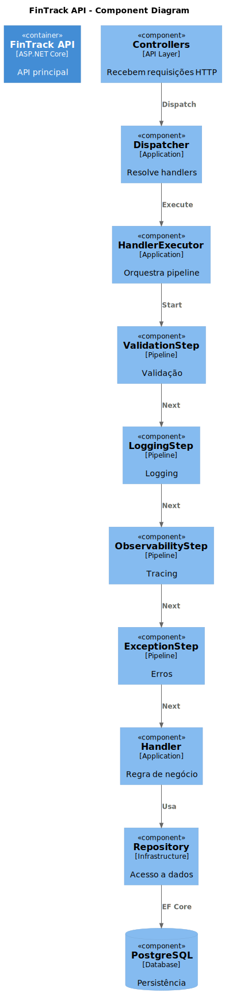

# 🧱 C4 Model — FinTrack API

Este documento descreve a arquitetura do sistema utilizando o modelo C4, permitindo visualizar o sistema em diferentes níveis de abstração.

O objetivo é facilitar a compreensão da estrutura do sistema, suas responsabilidades e relações entre componentes.

---

# 📍 1. Context Diagram

## 🎯 Objetivo

Apresentar o sistema no seu contexto mais amplo, destacando os usuários e sistemas com os quais ele interage.

---

## 🧠 Descrição

O FinTrack API é consumido por usuários através de aplicações cliente (web ou mobile), sendo responsável pelo gerenciamento de finanças pessoais.

Os dados são persistidos em um banco de dados relacional PostgreSQL.

---

## 🖼️ Diagrama

🔗 [Ver código do diagrama](./diagrams/context.puml)

---

# 📦 2. Container Diagram

## 🎯 Objetivo

Apresentar os principais blocos de execução do sistema e suas responsabilidades.

---

## 🧠 Descrição

O sistema é composto por uma API desenvolvida em ASP.NET Core, responsável pela lógica de aplicação, e um banco PostgreSQL para persistência dos dados.

A API implementa padrões arquiteturais como Clean Architecture e Pipeline Pattern.

---

## 🖼️ Diagrama

🔗 [Ver código do diagrama](./diagrams/container.puml)

---

# 🧠 3. Component Diagram

## 🎯 Objetivo

Detalhar a arquitetura interna da API, com foco no fluxo de execução e no pipeline de processamento das requisições.

---

## 🧠 Descrição

A aplicação utiliza um pipeline explícito baseado em steps para processar requisições, permitindo separação clara de responsabilidades e extensibilidade.

Esse modelo substitui abordagens tradicionais acopladas, tornando o fluxo de execução mais previsível e observável.

---

## 🖼️ Diagrama

🔗 [Ver código do diagrama](./diagrams/component.puml)

---

# 🧭 4. Interpretação dos Diagramas

## 🔹 Context

Apresenta o sistema como uma “caixa preta”, mostrando:

- quem utiliza o sistema
- quais sistemas externos estão envolvidos

---

## 🔹 Container

Apresenta os principais blocos executáveis do sistema:

- API
- Banco de dados

---

## 🔹 Component

Apresenta a estrutura interna da API, destacando:

- fluxo de execução
- responsabilidades de cada componente
- organização do pipeline

---

# 🧠 5. Insight Arquitetural

O principal diferencial da arquitetura está na adoção de um **pipeline explícito de execução**, onde:

- cada responsabilidade é isolada em um step
- a ordem de execução é controlada
- novos comportamentos podem ser adicionados sem alterar handlers

Esse modelo melhora:

- manutenibilidade
- testabilidade
- observabilidade

---

# ⚖️ 6. Considerações e Trade-offs

## ✔ Benefícios

- Arquitetura explícita e previsível
- Baixo acoplamento
- Facilidade de evolução
- Clareza na comunicação técnica

---

## ⚠️ Trade-offs

- Maior complexidade inicial
- Necessidade de disciplina arquitetural
- Curva de aprendizado para novos desenvolvedores

---

# 🚀 7. Evolução

Os diagramas devem evoluir conforme o sistema cresce, especialmente em cenários como:

- introdução de novos serviços
- evolução para arquitetura distribuída
- adição de novas camadas (ex: mensageria, cache)

---

# 📌 Observação

Este documento representa o estado atual da arquitetura e deve ser mantido atualizado para garantir sua utilidade como ferramenta de comunicação e tomada de decisão.